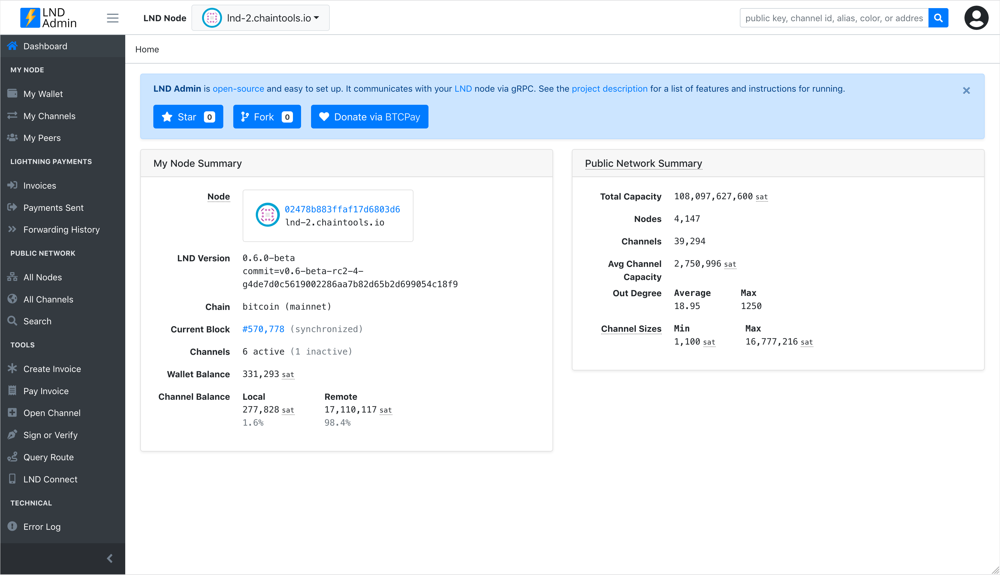

# LND Admin

[![npm version][npm-ver-img]][npm-ver-url] [![NPM downloads][npm-dl-img]][npm-dl-url]

Admin web interface for [LND](https://github.com/lightningnetwork/lnd), via gRPC. Built with Node.js, express, bootstrap-v4.

Live demo: https://lnd-admin.btc21.org

# Features

* UI for connecting to LND - requires host/port/admin.macaroon/tls.cert, which can be supplied in various ways, including using LND Connect strings
* Browse and search the public lightning network
* View invoices, payments, and forwarded payments
* Create and pay invoices
* Open and close channels
* Connect to multiple LND nodes and switch between them
* Simple/intuitive sorting filtering for most data
* Tools for sign/very, query route, generate LND Connect strings
* Star (favorite) nodes and channels
* Responsive design (but UI is data/table heavy, so works best on large screens)

# Getting started

### 1. Install/Run LND

* [Install LND](https://github.com/lightningnetwork/lnd/blob/master/docs/INSTALL.md)

### 2a. Install LND Admin (via NPM)

* `npm install -g lnd-admin`
* `lnd-admin`
* Open [http://127.0.0.1:3004/](http://127.0.0.1:3004/)

### 2b. Install LND Admin (from source)

* `git clone git@github.com:janoside/lnd-admin.git`
* `cd lnd-admin; npm install`
* `npm start`
* Open [http://127.0.0.1:3004/](http://127.0.0.1:3004/)

### 3. Setup LND Admin via UI

Once started, LND Admin's UI will guide you to set an admin password and then to connect to any LND nodes you're running. Your hashed password and your LND credentials (encrypted with your password), will be stored in the file `~/.lnd-admin/credentials.json`. If you restart the app after setup, you'll need to "unlock" with your same admin password (in order to decrypt LND credentials). Deleting this file at any time and restarting will prompt you to go through the setup process again.

# Credits

Thanks to inspiration from [LND](https://github.com/lightningnetwork/lnd), [Joule](https://lightningjoule.com/), [RTL](https://github.com/ShahanaFarooqui/RTL), [zap desktop](https://github.com/LN-Zap/zap-desktop), [lndash](https://github.com/djmelik/lndash), and [lnd-explorer](https://github.com/altangent/lnd-explorer).

# Donate

* [https://donate.btc21.org](https://donate.btc21.org)

[npm-ver-img]: https://img.shields.io/npm/v/lnd-admin.svg?style=flat
[npm-ver-url]: https://www.npmjs.com/package/lnd-admin
[npm-dl-img]: http://img.shields.io/npm/dm/lnd-admin.svg?style=flat
[npm-dl-url]: https://npmcharts.com/compare/lnd-admin?minimal=true
